<div align="center">
  
</div>

<br />

```text
visitor@lucenity:~$ cat about.txt
──────────────────────────────────────────────────────────
  me.lucenity.dev  ·  a portfolio you operate, not scroll
  boot it, and you're dropped at a prompt. type a command —
  a little retro window powers on with the answer.
  monochrome · pixels · CRT · zero frameworks · zero trackers
──────────────────────────────────────────────────────────
```


### `// what is this`

Most portfolios are a page you scroll. This one is a **terminal you talk to**.

It boots like an old machine — a BIOS stamp, a few self-checks, a drop to a prompt — and from
there every section of the site is a **command**. Ask for `about`, `projects`, `resume`, and a
draggable, resizable retro **window** powers on (CRT flicker and all) with that content inside.
Project windows embed the live site in a faux browser; anything that refuses to be framed falls
back to an "open in new tab" card. There's a cat. The cat is asleep. Do not wake the cat.


### `// commands`

Type `help` in the terminal and it lists these itself — the menu is generated from the registry,
so it never lies about what's actually wired up.

```text
help            list available commands
about           who is lucenity            → docs-style window + pixel avatar
resume          view my résumé
projects        browse my work             → filterable grid of thumbnails
project <slug>  open a specific project    → live embed, or fallback card
contact         how to reach me
liffy           chat with liffy, my lil assistant
whoami          print the current session identity
clear           clear the screen
```

Niceties that make it feel real: **↑/↓** history (persisted), **Tab** completion for commands and
project slugs, quote-aware argument parsing, `did-you-mean?` on typos, and **Ctrl+]** / **Ctrl+[**
to cycle between open windows. And a handful of commands that *aren't* in `help` — the cat drops
hints about those in its sleep, if you're patient.


### `// how it works`

```text
   keystrokes
       │
       ▼
  ┌─────────────┐   parses & dispatches   ┌──────────────────┐
  │  terminal   │ ──────────────────────▶ │ command registry │
  └─────────────┘                         └────────┬─────────┘
                                                   │ opens
                                                   ▼
  ┌──────────────────┐   spawns / focuses   ┌──────────────┐
  │  window manager  │ ◀─────────────────── │     apps     │
  │ drag·resize·max  │                      │ about·liffy· │
  │ minimize·cycle   │ ───────────────────▶ │ projects·…   │
  └──────────────────┘   renders content    └──────────────┘
```

- **`terminal`** captures input, keeps scrollback + history, and dispatches parsed commands.
- **`command registry`** maps words → actions and owns the `help` text (and Tab candidates).
- **`window manager`** spawns windows and handles drag, resize, focus/z-index, maximize,
  minimize-to-corner-folder, and keyboard cycling.
- **`apps`** render each window's body. `project-window` embeds a live site via `<iframe>` with a
  loading veil, a timeout, and an X-Frame-blocked fallback.
- **`liffy`** is a client-side retrieval bot grounded only in its own notes — behind a pluggable
  engine, so a real Claude backend can drop in later without touching the UI.


### `// built with`

`TypeScript` &nbsp;`Vite` &nbsp;·&nbsp; no runtime framework, no trackers, no analytics.

Every colour, font, and motion value lives in `src/styles/tokens.css` — the same monochrome/CRT
world as the site's under-construction page, so it reads as one continuous machine. **All motion
is gated behind `prefers-reduced-motion`**; turn it off and everything lands instantly, static.

```text
src/
├── core/     terminal · command-registry · window-manager · window · boot · fx · cat
├── apps/     about · resume · projects · project-window · contact · liffy
├── data/     commands · projects · about.md · liffy.md
└── styles/   tokens · base · terminal · window · apps · hero
```


### `// run it locally`

```bash
git clone https://github.com/lucenity0/portfolio.git
cd portfolio
npm install
npm run dev        # Vite dev server (picks a free port)
```

Then type `help` and start poking around.

```bash
npm run build      # typecheck + production build → dist/
npm run typecheck  # type-check app + vite config
```


<div align="center"><sub>built by <a href="https://github.com/lucenity0">@lucenity0</a> · <a href="https://me.lucenity.dev">me.lucenity.dev</a> · the cat is still asleep</sub></div>
